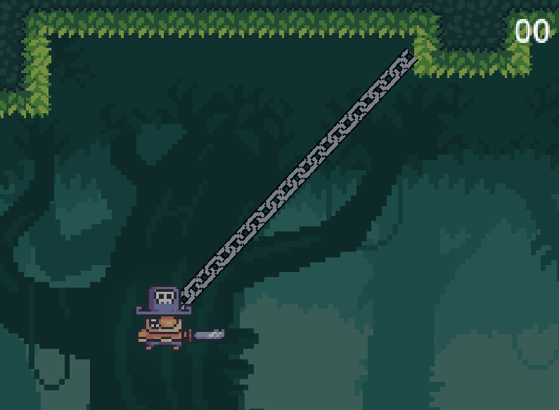

# 🏴‍☠️ Tidebound

Tidebound es un metroidvania en desarrollo con mecánicas de exploración, combate dinámico y plataformas. En este juego, el protagonista se embarca en una aventura en busca del tesoro perdido del legendario pirata Ronan "El Desatado" a través de un archipiélago lleno de secretos, rivales y trampas.

## IDE de desarrollo
  - Godot Engine 4.x
  - Visual Studio Code

## 🎮 Características

- 🌊 Mundo interconectado con múltiples zonas por explorar.
- ⚔️ Combate fluido con animaciones detalladas.
- 🏃‍♂️ Mecánicas de plataformas avanzadas con coyote time, jump buffer y un sistema de salto mejorado.
- 🔄 Viaje rápido entre checkpoints con un costo en monedas.
- 🏝️ Habitaciones ocultas y misiones secundarias para incentivar la exploración.

## 📜 Registro de Cambios

### 🗓️ 31 de marzo de 2025

- **Mejoras en el movimiento del personaje**:
  - Implementación de *coyote time* para permitir saltar justo después de abandonar una plataforma.
  - Implementación de *jump buffer* para mejorar la respuesta del salto.
  - Mejora del sistema de salto usando `Lerp` para una sensación más fluida y controlada.
  - Ajustes en la gravedad y el multiplicador de caída para una mejor sensación de peso del personaje.
  - Se implementó una máquina de estados para gestionar mejor las animaciones del personaje.
  
### 🗓️ 1 de abril de 2025

- **Intento de gancho**:
  
  Actualmente se está experimentando con la mecánica de gancho. Se intentó implementarlo usando:
  - **RayCast2D** para detectar colisiones con superficies enganchables.
  - **DampedSpringJoint2D** para generar la atracción del jugador hacia el punto de anclaje.
  - **Problema encontrado:** `CharacterBody2D` no se ve afectado por las físicas externas, lo que limita el movimiento natural del gancho.
  - **Próximo paso:** Evaluar si convertir al personaje en `RigidBody2D` o encontrar una solución alternativa con `CharacterBody2D`.

### 🗓️ 6 de abril de 2025

- **Implementación de la mecánica de gancho(basica)**:
  - Al final se recurrió al uso de `CharacterBody2D` para implementar la mecánica de gancho en vez de `RigidBody2D` a pesar de que no se ve afectado por las físicas externas, lo que limita el movimiento natural del gancho y aumenta el trabajo de implementación al tener que simular estas físicas adicionales.
  - Se implementó la mecánica de gancho básica usando `RayCast2D` y `Line2D`. Cuando el raycast detecta una colisión con una superficie enganchable, se activa el gancho y se mueve el personaje hacia el punto de anclaje, mediante una velocidad lineal.
- **Cambios a hacer**:
  - Modificar la velocidad del gancho para que sea más fluida y controlada. Se puede implementar una función de interpolación para mejorar la sensación de fluidez. Además de simular esta atracción como un resorte siguiendo la formula de la Ley de Hooke (F = k * x) modificada añadiendole una fuerza de amortiguamiento (F = k * x * t) para evitar que el resorte oscile indefinidamente, (F = (k * x) - (v * springDamping)).

### 🗓️ 7 de abril de 2025

- **Refactorizar código del Player**:
  - Se refactoriza el código del Player para que sea mas fácil de mantener y mejorar. Se han añadido dos componentes: HookComponent y MovementComponent. HookComponent implementa la mecánica de gancho y MovementComponent implementa el movimiento del personaje. Se ha añadido un nuevo script de interfaz llamado IHook, que define las propiedades de la mecánica de gancho. Se ha añadido una interfaz de AttackInterface, que define las propiedades de la mecánica de ataque.

### 🗓️ 9 de abril de 2025

- **Areglando fisica del personaje cuando tiene el gancho desplegado**:
  - **Problema encontrado:** : El componente del gancho perdia el control del movimiento del personaje entre frames porque no desabilitabamos el movimiento en el compomente MovementComponent.
  - **Solución:** : Se ha añadido una propiedad `SkipGravityFrame` en el componente de gancho que se activa en el frame de la caída del personaje, justo depues de desactivar el gancho para evitar que el movimiento del personaje se habilite. Y así poder también resetear la velocidad vertical.
  - **Cambios a hacer** : Mejorar la suabidad de la subida del personaje cuando tiene el gancho desplegado. Y intentar un balanceo.

### 🗓️ 12 de abril de 2025

- **Modificado Gancho para use una textura y se repita depediendo del tamaño del line 2d y del punto de anclaje**:
<p align="center">
  
</p>

### 🗓️ 13 de abril de 2025

- **Implementando ley de Hooke para que el gancho tenga un comportamiento de muelle y balaceo de personaje**:
  - **Implementación:** : Se ha implementado la ley de Hooke para que el gancho tenga un comportamiento de muelle y por consiguiente el balaceo de personaje. Se ha añadido una propiedad `springStrength` en el componente de gancho para controlar la constante de rigidez de la ley de Hooke. Se ha añadido una propiedad `damping` para controlar la resistencia de la ley de Hooke. Se ha añadido una propiedad `hookStopDistance` para controlar la distancia de stop del gancho.
  - **Cambios a hacer:** : Posible implementación de balanceo con los botones de movimiento del personaje.
  - **Problema encontrado:** : Funcionalidad en el mando incorrecta ya que el puntero hay que moverlo con uno de los joysticks para que funcione (Aún no implementado).

### 🗓️ 18 de abril de 2025

- **Arreglando algunos bugs**:
  - El personaje no se podía mover cuando este saltaba
- **Añadiendo algunos assets de decoración**
- **Desarrollando la primera zona del juego**

### 📅 20 de abril de 2025

- **Refactorizando la escena de pinchos y corrigiendo algunos errores**:

  - **Nuevo componente `Spikes`**: Se ha creado un nuevo componente para los pinchos del escenario.
  - **Actualización de `Spikes.tscn`**: Se cambió el tipo de nodo `Spike` a `Sprite2D` y se añadió un área de colisión (`Hitbox`) para detectar colisiones.
  - **Nuevo script `Spikes.cs`**: Se añadió para configurar dinámicamente la forma de colisión en base a la región del sprite.
  - **Ajuste en `Camera.cs`**: Se eliminó el desplazamiento de la cámara para que la vista quede más centrada.
  - **Mejoras en el movimiento del jugador (`CompMov_Player.cs`)**: 
    - Se redujo la velocidad y la velocidad de salto.
    - Se ajustaron los multiplicadores para una física de salto más precisa.
  
### 📅 27 de abril de 2025

- **Creacion de nuevos componentes**:
  - **Implementación de un nuevo sistema de daño**: Se ha creado un nuevo componente `HealthComponent` para gestionar la salud del jugador y los enemigos. Este componente permite recibir daño y aplicar efectos visuales al recibirlo.
  - **Implementación de un nuevo sistema de daño**: Se ha creado un nuevo componente `DamageComponent` para gestionar el daño del jugador y los enemigos. Este componente permite aplicar daño a los enemigos y al jugador.
- **Desarrollo de la primera escena del juego (zona de tutorial)**

### 📅 1 de mayo de 2025


-**Conexion de HealthComponent y DamageComponent e Implementacion de pushback**: Se ha conectado el componente `HealthComponent` con el componente `DamageComponent` para que el jugador y los enemigos puedan recibir daño y aplicar efectos visuales al recibirlo. Este sistema permite que el jugador y los enemigos sean empujados hacia atrás al recibir daño, lo que añade una nueva capa de estrategia al combate. Por medio de un nuevo componente `DamageComponent` que se encarga de gestionar el retroceso al recibir daño. Este componente permite ajustar la fuerza y la dirección del retroceso, así como la duración del mismo.
  - **Problema encontrado:** : Cuando el personaje recibe daño solo le quita 1 de vida, cada enemigo tiene un daño especifico
- **Impemetado imvulnerabilidad temporal**:Se ha añadido a la animacion de hit una inmunidad temporal al recibir daño. Esto permite que el jugador tenga un breve periodo de invulnerabilidad después de recibir daño, lo que le da la oportunidad de reaccionar y evitar más daño

## ✅ TO-DO LIST  

### 🔧 Mecánicas del Personaje
- [x] Implementar coyote time  
- [x] Implementar jump buffer  
- [x] Ajustar gravedad y caída con fallMultiplier  
- [x] Refactorizar movimiento en MovementComponent  
- [ ] Permitir animación de caminar + atacar simultáneamente (→ usar AnimationTree con capas o blend)  
- [ ] Agregar sistema de esquive o dash (si aplica al combate dinámico)  
- [x] Añadir animación de daño + sistema de invulnerabilidad temporal  
- [ ] Añadir feedback visual/sonoro al recoger objetos, atacar y recibir daño  

### 🪝 Mecánica de Gancho
- [x] Implementar raycast + gancho básico  
- [x] Controlar gravedad al desengancharse (SkipGravityFrame)  
- [x] Mostrar gancho con Line2D y textura repetible  
- [x] Suavizar movimiento al engancharse (usando Hooke + damping)  
- [x] Implementar balanceo (sistema de péndulo/balanceo con dirección y fuerza)  
- [ ] Permitir cancelar gancho en cualquier momento (botón específico)  
- [ ] Añadir límites de uso del gancho o cooldown (según balanceo)  
- [ ] Indicar visualmente si una superficie es enganchable  

### 🗡️ Combate
- [ ] Crear un sistema de AttackComponent más flexible (distancia, tipo, área, cooldown)  
- [ ] Añadir animaciones cancelables para ataques rápidos  
- [ ] Implementar enemigos básicos con IA simple (seguimiento, ataque)  
- [ ] Agregar daño por contacto, hitbox y hurtbox  
- [ ] Diseñar y animar ataques especiales o combos  
- [ ] Balancear ataques con retroceso (knockback)  
- [ ] Añadir sistema de mejoras de combate (habilidades o armas)  

### 🧭 Exploración y Progresión
- [x] Sistema de checkpoints y viaje rápido con monedas  
- [ ] Implementar puertas bloqueadas por habilidades (para progresión tipo metroidvania)  
- [ ] Añadir HUD que muestre mapa o mini-mapa  
- [ ] Guardar progreso del jugador (posición, habilidades, monedas, etc.)  
- [ ] Agregar NPCs con misiones secundarias  
- [ ] Crear un sistema de diálogo sencillo  
- [ ] Ocultar habitaciones opcionales con paredes rompibles o ilusorias  

### 🖼️ UI y Menús
- [ ] Pantalla de pausa con inventario y mapa  
- [x] Pantalla de records (tiempos, objetos recolectados, bosses derrotados)  
- [x] Pantalla de ayuda/tutorial explicando mecánicas  
- [ ] Añadir animación y transición entre pantallas (Fade, slide, etc.)  
- [ ] Indicadores visuales de estado (gancho activo, ataque cargado, etc.)  

### 🎨 Arte y Efectos
- [x] Textura para el gancho en Line2D  
- [ ] Añadir partículas al caminar, atacar y usar gancho  
- [ ] Efecto de cámara (shake) al golpear o recibir daño  
- [ ] Sistema de sombras y luces dinámicas para atmósfera  
- [ ] Variantes visuales para zonas (selva, ruinas, cavernas, etc.)  

### 🔍 Técnicos y Refactor
- [x] Dividir Player en componentes (MovementComponent, HookComponent, etc.)  
- [x] Crear sistema de estados robusto (Idle, Walking, Attacking, Hooking, Dashing, etc.)  
- [x] Modularizar el código para facilitar mantenimiento (enemigos, UI, etc.)  
- [x] Crear señales (Signal) claras entre componentes (ej: gancho terminado, ataque lanzado)  
- [ ] Mejorar sistema de animaciones con AnimationTree y blend  

### 🎮 Nivel y Diseño
- [ ] Crear una zona inicial bien pulida con tutorial natural (tipo Hollow Knight)  
- [ ] Colocar objetos que incentiven el uso del gancho  
- [ ] Incluir zonas con enemigos que requieren dominar la movilidad  
- [ ] Añadir desafíos secundarios (cronos, parkour, secretos)  


## 🚀 Instalación y Ejecución

1. Clonar el repositorio:
   ```bash
   git clone https://github.com/VioletGminisJ25/PirateGame.git
   ```
2. Importar el proyecto en *Godot* (versión 4.x).
3. Ejecutar el juego desde el editor.

## 🏗️ Contribuciones

Si deseas contribuir con ideas, código o reportes de errores, siéntete libre de abrir un *issue* o enviar un *pull request* en [el repositorio](https://github.com/VioletGminisJ25/PirateGame).

## 📜 Licencia

Este proyecto está bajo la licencia MIT. Puedes usarlo y modificarlo libremente, siempre que des crédito a los autores originales.

¡Gracias por seguir el desarrollo de *Tidebound*! 🏴‍☠️

